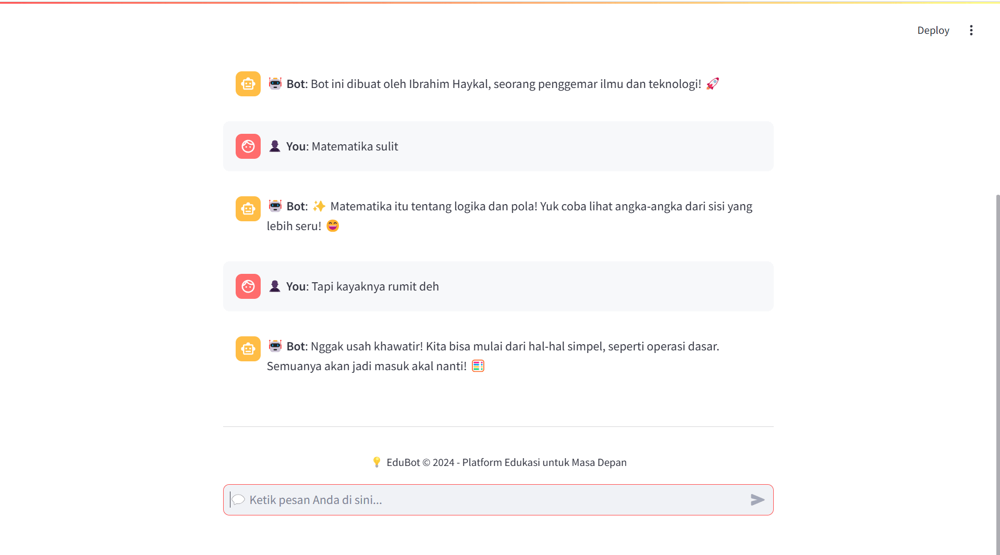

# EduBot: AI Chatbot untuk Pembelajaran Interaktif 🎓🤖



**EduBot** adalah chatbot berbasis AI yang dirancang untuk mendukung pembelajaran interaktif. Menggunakan teknologi *deep learning*, EduBot mampu memahami dan merespon pertanyaan pengguna dengan cara yang natural dan informatif. EduBot dibangun dengan Python menggunakan pustaka seperti TensorFlow, NLTK, dan Streamlit untuk pengalaman pelatihan model dan pengujian yang intuitif.

---

## 🚀 Fitur Utama

- **Pembelajaran Interaktif:** EduBot memahami berbagai pertanyaan terkait pembelajaran dan memberikan jawaban yang relevan.
- **Peningkatan Akurasi dengan NLP:** Memanfaatkan teknik NLP seperti tokenisasi, *word embeddings*, dan pemrosesan *stopwords* untuk pengenalan pola yang lebih baik.
- **Antarmuka Interaktif:** Dengan Streamlit, pelatihan dan pengujian model menjadi lebih sederhana dan visual.
- **Model AI Modern:** Menggunakan arsitektur LSTM bidirectional untuk performa yang optimal.

---

## 🛠️ Teknologi yang Digunakan

- **Python Libraries:**
  - `TensorFlow` untuk pembangunan model *deep learning*
  - `NLTK` untuk pemrosesan bahasa alami
  - `NumPy` untuk manipulasi data
  - `Scikit-learn` untuk evaluasi model
- **Framework:**
  - `Streamlit` untuk antarmuka pelatihan dan pengujian
- **Model Arsitektur:**
  - Bidirectional LSTM dengan *embedding layer* dan *batch normalization*

---

## 📥 Instalasi

### Persyaratan
- Python >= 3.8
- Pustaka yang dibutuhkan (lihat di bawah)

### Langkah-langkah
1. Clone repositori ini:
   ```bash
   git clone https://github.com/ibrahimhaykal/chatbot-edu-bot.git
   cd chatbot-edu-bot
   ```

2. Buat dan aktifkan lingkungan virtual:
   ```bash
   python -m venv venv
   source venv/bin/activate    # Untuk Linux/Mac
   venv\Scripts\activate       # Untuk Windows
   ```

3. Instal dependensi:
   ```bash
   pip install -r requirements.txt
   ```

4. Jalankan aplikasi:
   ```bash
   streamlit run app.py
   ```

---

## 🎓 Cara Kerja EduBot

### 1. **Pelatihan Model**
   - Data dilatih menggunakan arsitektur LSTM bidirectional.
   - Digunakan `EarlyStopping` untuk menghindari *overfitting*.

### 2. **Pemrosesan Data**
   - Menggunakan `nltk` untuk *stemming*, *lemmatization*, dan penghilangan kata-kata umum (*stopwords*).
   - Data teks dikonversi menjadi token dan di-*padding* untuk pelatihan.

### 3. **Evaluasi Model**
   - EduBot dievaluasi dengan *metrics* seperti *accuracy* dan laporan klasifikasi (`classification_report`).

---

## 📊 Pelatihan dan Pengujian Model

### Antarmuka Streamlit
EduBot dilengkapi dengan *dashboard* interaktif menggunakan **Streamlit**, yang memudahkan Anda untuk:
1. **Melakukan Pelatihan Model**: Mengunggah data dan memulai pelatihan.
2. **Menguji Model AI**: Memberikan input teks dan mendapatkan respon langsung dari chatbot.
3. **Melihat Hasil Evaluasi**: *Dashboard* menampilkan metrik evaluasi, termasuk akurasi dan *loss*.

---

---

## 📚 Dokumentasi

- **Struktur Proyek:**
```
├── assets/                 # Folder untuk menyimpan aset seperti gambar atau gif
├── app.py                  # Antarmuka Streamlit untuk pengujian chatbot
├── chatbot_model.h5        # Model chatbot yang telah dilatih
├── chatboteducation.ipynb  # Notebook Jupyter untuk eksperimen dan pelatihan model
├── dataset.json            # Dataset untuk melatih chatbot
├── label_encoder.json      # File encoding label kelas
├── tokenizer.json          # Tokenizer untuk pemrosesan teks
└── README.md               # Dokumentasi proyek
```

### **Pustaka Utama yang Digunakan** 🛠️

EduBot dibangun dengan berbagai pustaka Python canggih untuk mendukung pembelajaran mesin dan pemrosesan bahasa alami:

| **Kategori**          | **Pustaka Utama**                                                                                      |
|-----------------------|-------------------------------------------------------------------------------------------------------|
| **Data & Pemrosesan** | `numpy`, `json`, `re`, `random`                                                                       |
| **Deep Learning**     | `tensorflow`, `keras`                                                                                |
| **NLP**               | `nltk`, `wordnet`, `stopwords`, `Tokenizer`, `pad_sequences`                                         |
| **Pemrosesan Model**  | `LabelEncoder`, `train_test_split`, `classification_report`                                          |
| **Arsitektur Model**  | `Sequential`, `Embedding`, `LSTM`, `Dense`, `Dropout`, `Bidirectional`, `BatchNormalization`         |
| **Optimisasi**        | `EarlyStopping`                                                                                      |

---

---

## 🤝 Kontribusi

Kontribusi terbuka untuk pengembangan EduBot. Untuk memulai:
1. *Fork* repositori ini.
2. Buat cabang fitur baru (`git checkout -b fitur-anda`).
3. Kirimkan *pull request* ke repositori utama.


---

⭐ **Jangan lupa memberikan bintang pada repositori ini jika Anda merasa proyek ini bermanfaat!** ⭐
```
